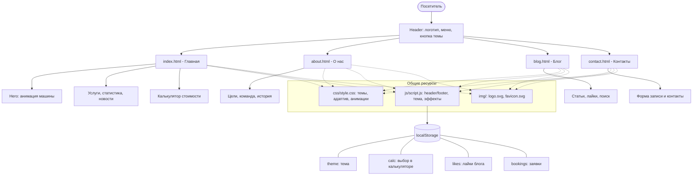
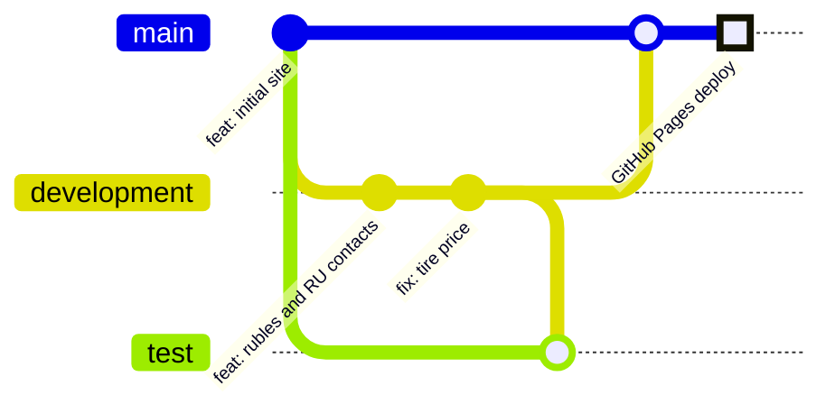

# Диаграммы проекта TurboGarage

## Структура сайта и работа скрипта

```mermaid
flowchart TD
    V(["Посетитель"]) --> H["Header: логотип, меню, кнопка темы"]
    H --> I["index.html - Главная"]
    H --> A["about.html - О нас"]
    H --> B["blog.html - Блог"]
    H --> C["contact.html - Контакты"]

    I --> I1["Hero: анимация машины"]
    I --> I2["Услуги, статистика, новости"]
    I --> I3["Калькулятор стоимости"]
    A --> A1["Цели, команда, история"]
    B --> B1["Статьи, лайки, поиск"]
    C --> C1["Форма записи и контакты"]

    subgraph Assets["Общие ресурсы"]
        CSS["css/style.css: темы, адаптив, анимации"]
        JS["js/script.js: header/footer, тема, эффекты"]
        IMG["img/: logo.svg, favicon.svg"]
    end

    I & A & B & C -.-> CSS
    I & A & B & C -.-> JS
    I & A & B & C -.-> IMG

    JS --> LS[("localStorage")]
    LS --- L1["theme: тема"]
    LS --- L2["calc: выбор в калькуляторе"]
    LS --- L3["likes: лайки блога"]
    LS --- L4["bookings: заявки"]
```

## Git-ветки и деплой

```mermaid
gitGraph
    commit id: "feat: initial site"
    branch development
    branch test
    checkout development
    commit id: "feat: rubles and RU contacts"
    commit id: "fix: tire price"
    checkout test
    merge development
    checkout main
    merge development
    commit id: "GitHub Pages deploy" type: HIGHLIGHT
```
